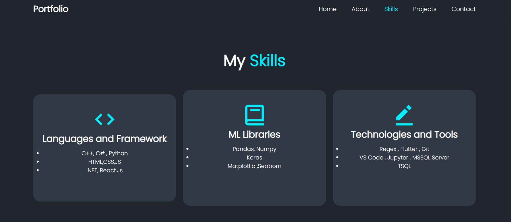
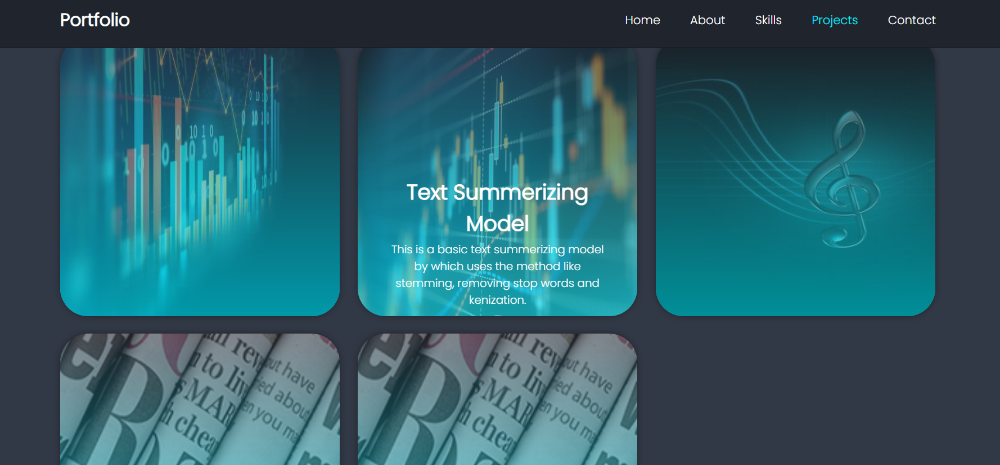
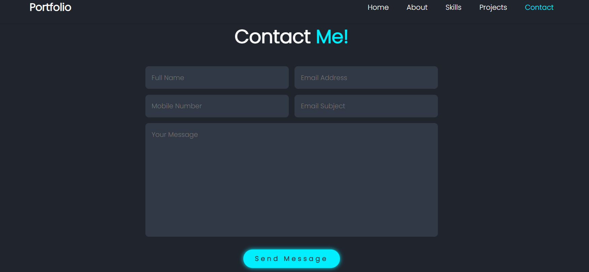

# My Portfolio

This portfolio showcases my projects, skills, and provides a way to connect with me.

## Table of Contents

- [Introduction](#introduction)
- [Installation](#installation)
- [Features](#features)
- [Technologies Used](#technologies-used)
- [Contributing](#contributing)

## Introduction

My portfolio serves as a personal website where I showcase my projects, skills, and provide a way for visitors to connect with me. It includes sections for home, about, skills, projects, and contact.

## Installation

## Features

- **Responsive Design:** The portfolio is designed to be responsive across different devices and screen sizes, ensuring a consistent user experience.
- **Project Showcase:** It includes a section to showcase my projects, each with a brief description and links to their GitHub repositories or live demos.
- **Skills Display:** A section highlighting my skills and areas of expertise, helping visitors understand my technical abilities.
- **Contact Form:** A contact section with a form that allows visitors to send me messages directly from the website.
- **Downloadable CV:** A download button is provided for visitors to download my CV directly from the website.

## Technologies Used

- HTML
- CSS
- JavaScript

## Images

- Home Page  
  

- Skills  
  

- Projects  
  

- Contact Me  
  
